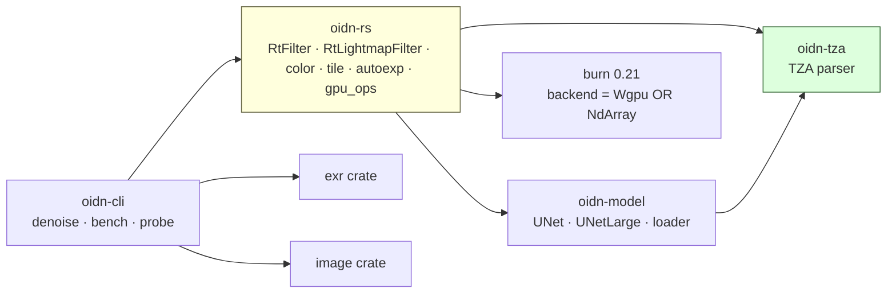
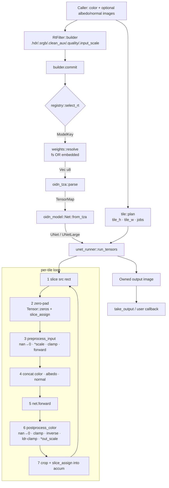
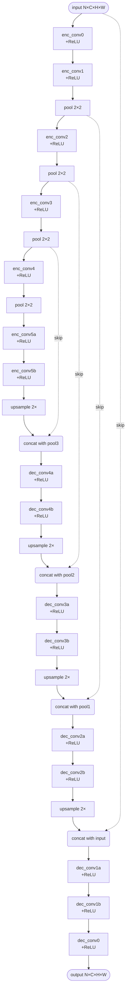
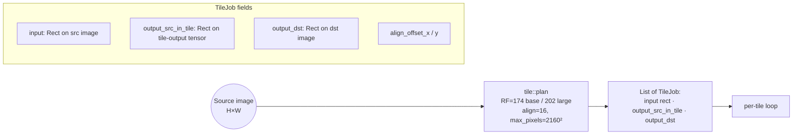
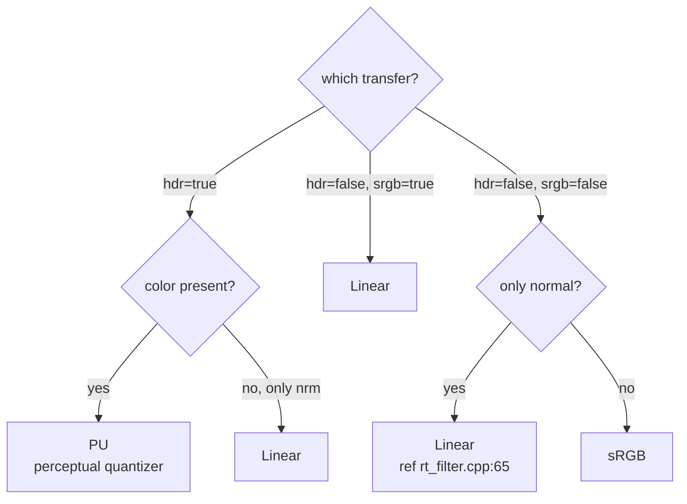
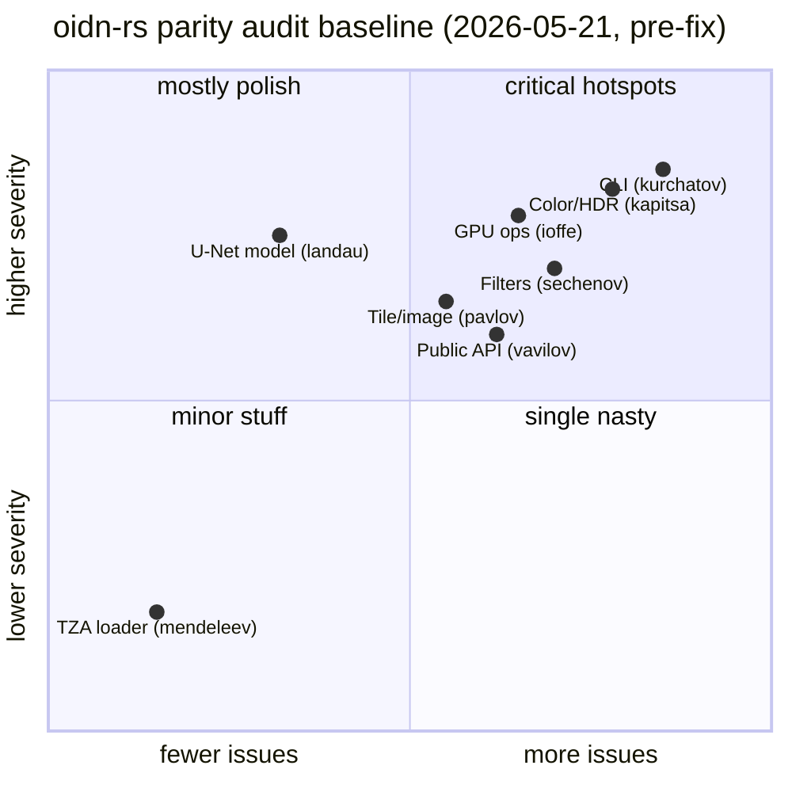
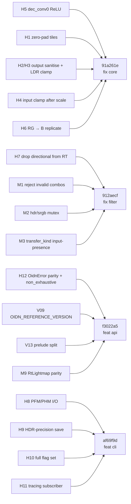
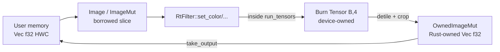

# DIAGRAMS.md — oidn-rs flow & topology in Mermaid

Renders for the parity audit (2026-05-21). See `AGENTS.md` for the ASCII counterparts.

---

## Crate dependency graph

---

## End-to-end dataflow

---

## U-Net topology (base)

---

## Tile geometry

`tileOverlap = round_up(RF/2, align)`  →  base: 96 px, large: 112 px.

---

## Transfer-function decision tree (RT filter)

`transfer_kind(has_color: bool, hdr: bool, srgb: bool)` in `filters/rt.rs` mirrors the reference decision tree exactly. `has_color=false` short-circuits to `Linear` for normal-only / albedo-only routes (previously defaulted to sRGB).

---

## Audit baseline — issue density (historical, pre-fix)

All 12 HIGH and the listed MED items are now closed — see commits
`91a261e`, `912aecf`, `f3022a5`, `af69f9d` on `main`.

---

## Fix delivery (status: DONE)

---

## Memory & ownership conventions

No `Buffer` abstraction (V vavilov §2). Zero-copy with externally-owned GPU memory is currently impossible (M8); every input round-trips through host RAM.

---

End of diagrams.
