# DIAGRAMS.md — oidn-rs flow & topology in Mermaid

Updated 2026-10-02. The final systematic-repair diagram describes the current repaired working tree; preceding audit diagrams describe historical baseline `bebbfc5`, including its open defects. Original reference anchors use pinned v2.4.1. The subsequent local-reference follow-up uses `D:/Projects/vfx.ref/oidn`, clean v2.5.0 commit `f7ae1bf07b3201aaa8cfe04d71f5243f8e0f2bb7`; version-specific evidence remains distinct. Proposed diagrams retain their historical labels; the subsequent user instruction authorized systematic implementation. Historical May audit diagrams are retained with bounded status. See [AGENTS.md](AGENTS.md), [plan2.md](plan2.md), and the linked audit reports.

---

## Crate dependency graph

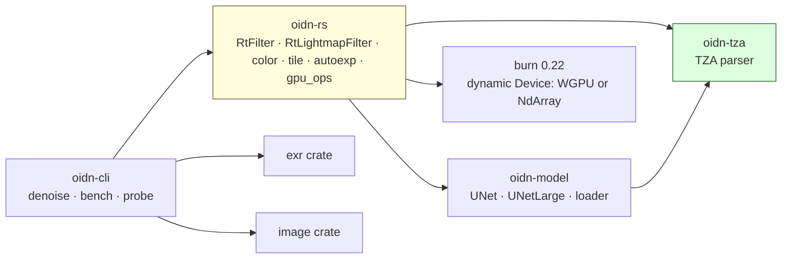
```mermaid
graph LR
    cli[oidn-cli<br/>denoise · bench · probe] --> facade[oidn-rs<br/>RtFilter · RtLightmapFilter · color · tile · autoexp · gpu_ops]
    facade --> model[oidn-model<br/>UNet · UNetLarge · loader]
    facade --> tza[oidn-tza<br/>TZA parser]
    model --> tza
    facade --> burn[burn 0.22<br/>dynamic Device: WGPU or NdArray]
    cli --> exr[exr crate]
    cli --> img[image crate]
    style facade fill:#ffd,stroke:#664
    style tza fill:#dfd,stroke:#363
```

---

## Historical baseline end-to-end dataflow

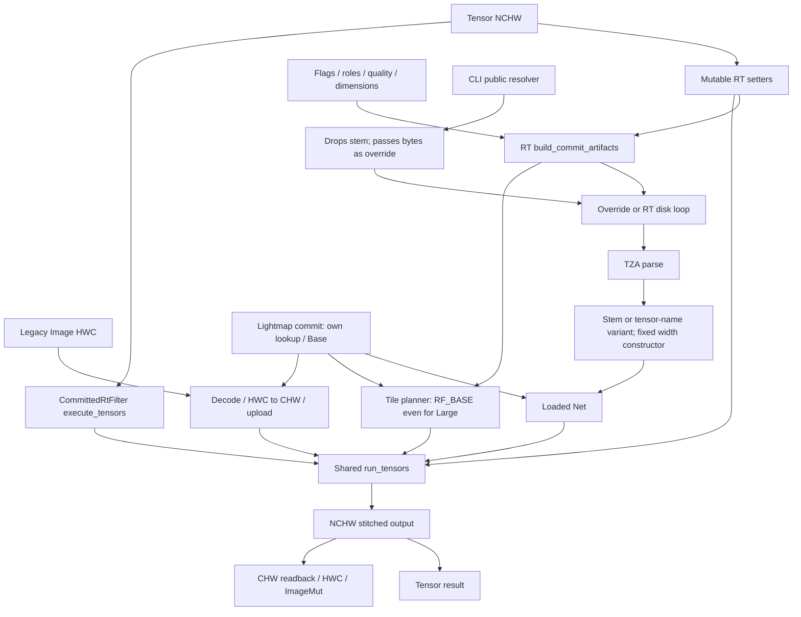
```mermaid
flowchart TB
    host["Legacy Image HWC"] --> upload["Decode / HWC to CHW / upload"]
    tensor["Tensor NCHW"] --> mutable["Mutable RT setters"]
    tensor --> immutable["CommittedRtFilter execute_tensors"]
    flags["Flags / roles / quality / dimensions"] --> commit["RT build_commit_artifacts"]
    mutable --> commit
    commit --> resolution["Override or RT disk loop"]
    cli["CLI public resolver"] --> custom["Drops stem; passes bytes as override"]
    custom --> resolution
    resolution --> parse["TZA parse"]
    parse --> fixed["Stem or tensor-name variant; fixed width constructor"]
    fixed --> net["Loaded Net"]
    commit --> plan["Tile planner: RF_BASE even for Large"]
    upload --> runner["Shared run_tensors"]
    mutable --> runner
    immutable --> runner
    net --> runner
    plan --> runner
    runner --> accum["NCHW stitched output"]
    accum --> tensorout["Tensor result"]
    accum --> readback["CHW readback / HWC / ImageMut"]
    lm["Lightmap commit: own lookup / Base"] --> net
    lm --> plan
    lm --> upload
```

Anchors: RT496,504-584,650-695,798-841; lightmap218-319; runner266-326. Short Rust anchors refer to `crates/oidn-rs/src/filters/`; detailed paired evidence is in [pipeline](bughunt/pipeline.md) and [geometry/API](bughunt/geometry_api.md).

## Historical baseline tile packing and mode defects

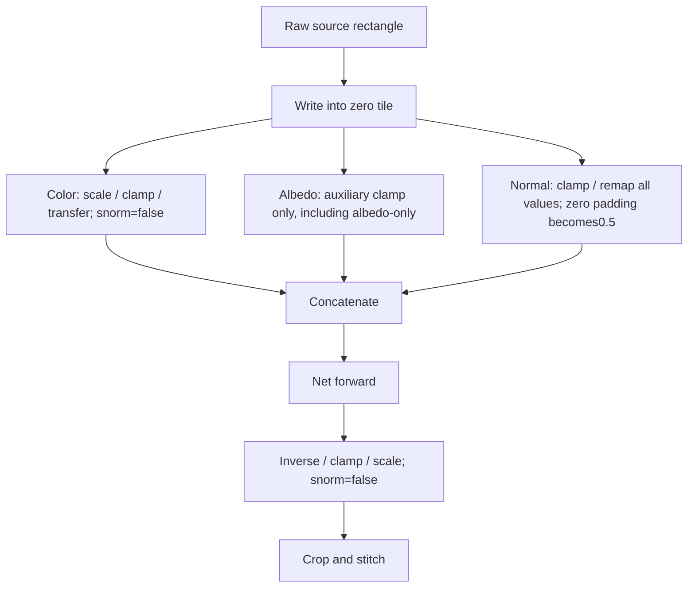
```mermaid
flowchart TB
    source["Raw source rectangle"] --> pad["Write into zero tile"]
    pad --> color["Color: scale / clamp / transfer; snorm=false"]
    pad --> alb["Albedo: auxiliary clamp only, including albedo-only"]
    pad --> nrm["Normal: clamp / remap all values; zero padding becomes0.5"]
    color --> cat["Concatenate"]
    alb --> cat
    nrm --> cat
    cat --> forward["Net forward"]
    forward --> post["Inverse / clamp / scale; snorm=false"]
    post --> crop["Crop and stitch"]
```

Actual code: `unet_runner.rs:161-240`. Padding, primary-role handling and signed output are open findings P1-P4. This diagram does not certify parity.

## Proposed shared execution contract — implementation pending

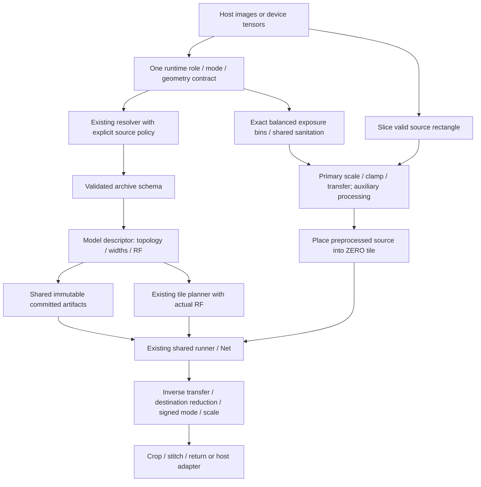
```mermaid
flowchart TB
    input["Host images or device tensors"] --> validate["One runtime role / mode / geometry contract"]
    validate --> resolve["Existing resolver with explicit source policy"]
    resolve --> schema["Validated archive schema"]
    schema --> descriptor["Model descriptor: topology / widths / RF"]
    descriptor --> artifact["Shared immutable committed artifacts"]
    descriptor --> tile["Existing tile planner with actual RF"]
    validate --> exposure["Exact balanced exposure bins / shared sanitation"]
    input --> slice["Slice valid source rectangle"]
    exposure --> prep["Primary scale / clamp / transfer; auxiliary processing"]
    slice --> prep
    prep --> zero["Place preprocessed source into ZERO tile"]
    zero --> run["Existing shared runner / Net"]
    artifact --> run
    tile --> run
    run --> output["Inverse transfer / destination reduction / signed mode / scale"]
    output --> stitch["Crop / stitch / return or host adapter"]
```

Primary selection is color, otherwise albedo, otherwise normal; signed mode is directional or normal-only. Source contract: reference `gpu_input_process.h:244-246`, `core/unet_filter.cpp:551-564`. Preserve host/tensor and lightmap functionality rather than create separate runners.

---

## U-Net topology (base)

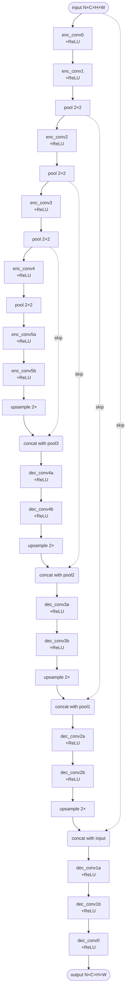
```mermaid
flowchart TB
    in([input N×C×H×W])
    in --> ec0[enc_conv0<br/>+ReLU]
    ec0 --> ec1[enc_conv1<br/>+ReLU]
    ec1 --> p1[pool 2×2]
    p1 --> ec2[enc_conv2<br/>+ReLU]
    ec2 --> p2[pool 2×2]
    p2 --> ec3[enc_conv3<br/>+ReLU]
    ec3 --> p3[pool 2×2]
    p3 --> ec4[enc_conv4<br/>+ReLU]
    ec4 --> p4[pool 2×2]
    p4 --> ec5a[enc_conv5a<br/>+ReLU]
    ec5a --> ec5b[enc_conv5b<br/>+ReLU]
    ec5b --> u4[upsample 2×]
    u4 --> cc4(concat with pool3)
    p3 -. skip .-> cc4
    cc4 --> dc4a[dec_conv4a<br/>+ReLU]
    dc4a --> dc4b[dec_conv4b<br/>+ReLU]
    dc4b --> u3[upsample 2×]
    u3 --> cc3(concat with pool2)
    p2 -. skip .-> cc3
    cc3 --> dc3a[dec_conv3a<br/>+ReLU]
    dc3a --> dc3b[dec_conv3b<br/>+ReLU]
    dc3b --> u2[upsample 2×]
    u2 --> cc2(concat with pool1)
    p1 -. skip .-> cc2
    cc2 --> dc2a[dec_conv2a<br/>+ReLU]
    dc2a --> dc2b[dec_conv2b<br/>+ReLU]
    dc2b --> u1[upsample 2×]
    u1 --> cc1(concat with input)
    in -. skip .-> cc1
    cc1 --> dc1a[dec_conv1a<br/>+ReLU]
    dc1a --> dc1b[dec_conv1b<br/>+ReLU]
    dc1b --> dc0[dec_conv0<br/>+ReLU]
    dc0 --> out([output N×C×H×W])
```

---

## Tile geometry

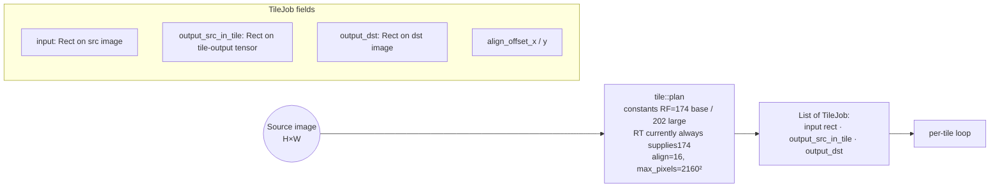
```mermaid
flowchart LR
    img((Source image<br/>H×W))
    img --> plan[tile::plan<br/>constants RF=174 base / 202 large<br/>RT currently always supplies174<br/>align=16, max_pixels=2160²]
    plan --> jobs[List of TileJob:<br/>input rect · output_src_in_tile · output_dst]
    jobs --> tloop[per-tile loop]

    subgraph job[TileJob fields]
        f1[input: Rect on src image]
        f2[output_src_in_tile: Rect on tile-output tensor]
        f3[output_dst: Rect on dst image]
        f4[align_offset_x / y]
    end
```

`tileOverlap = round_up(RF/2, align)`  →  base: 96 px, large: 112 px.

---

## Current and proposed transfer selection

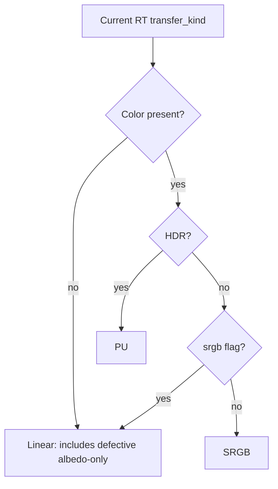
```mermaid
flowchart TB
    start["Current RT transfer_kind"] --> present{"Color present?"}
    present -- no --> linear["Linear: includes defective albedo-only"]
    present -- yes --> hdr{"HDR?"}
    hdr -- yes --> pu["PU"]
    hdr -- no --> srgb{"srgb flag?"}
    srgb -- yes --> linear
    srgb -- no --> encoded["SRGB"]
```

Current `rt.rs:479-493` is not exact reference parity. Proposed selection uses actual primary kind: normal-only or srgb -> Linear; otherwise HDR -> PU; otherwise SRGB (`core/rt_filter.cpp:63-70`). Lightmap retains its distinct Log/Linear selection; signed mode must be passed through the existing runner.

---

## Audit baseline — issue density (historical, pre-fix)

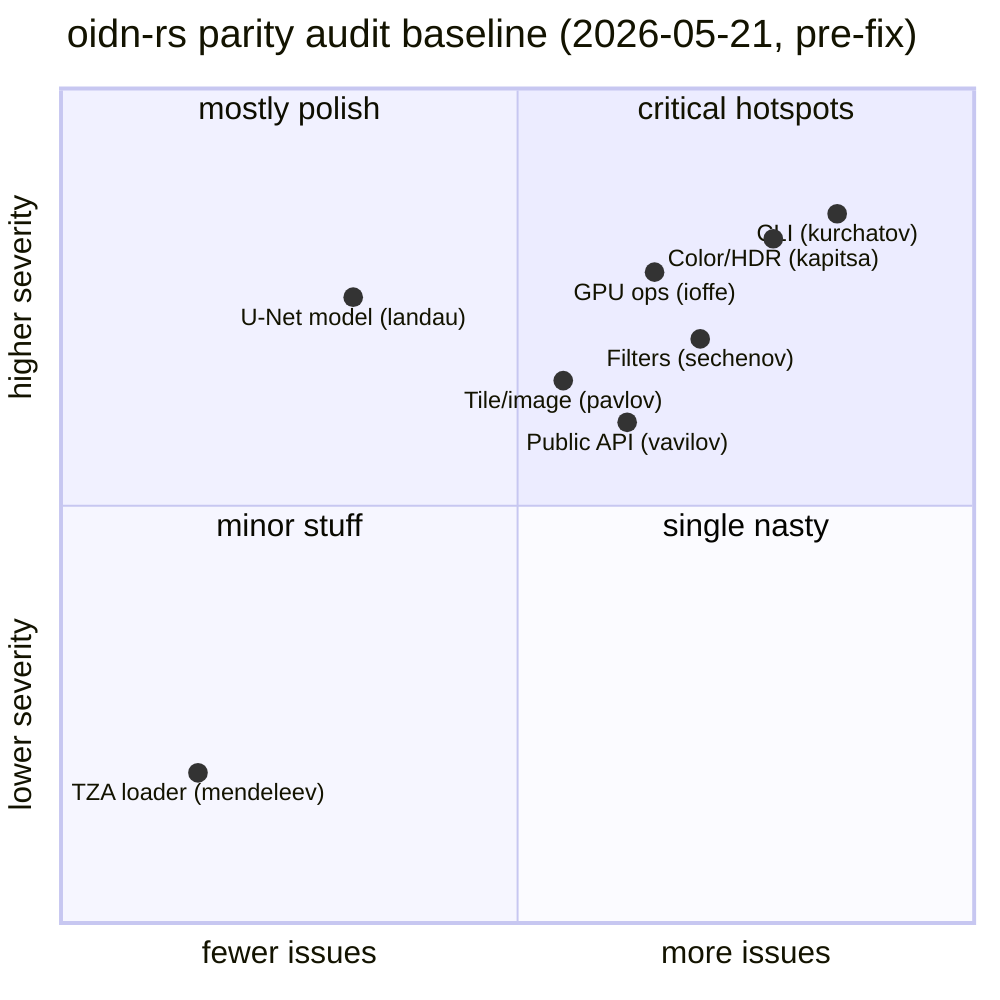
```mermaid
quadrantChart
    title oidn-rs parity audit baseline (2026-05-21, pre-fix)
    x-axis "fewer issues" --> "more issues"
    y-axis "lower severity" --> "higher severity"
    quadrant-1 "critical hotspots"
    quadrant-2 "mostly polish"
    quadrant-3 "minor stuff"
    quadrant-4 "single nasty"
    "TZA loader (mendeleev)": [0.15, 0.18]
    "U-Net model (landau)": [0.32, 0.75]
    "Color/HDR (kapitsa)": [0.78, 0.82]
    "Tile/image (pavlov)": [0.55, 0.65]
    "Filters (sechenov)": [0.7, 0.7]
    "GPU ops (ioffe)": [0.65, 0.78]
    "Public API (vavilov)": [0.62, 0.6]
    "CLI (kurchatov)": [0.85, 0.85]
```

Historical May audit claimed closure in commits `91a261e`, `912aecf`, `f3022a5`, `af69f9d`. That claim is retained as history, not current assurance: the October static audit confirms remaining and newly identified semantic defects. See [plan2.md](plan2.md).

---

## Historical May fix delivery (not current issue closure)

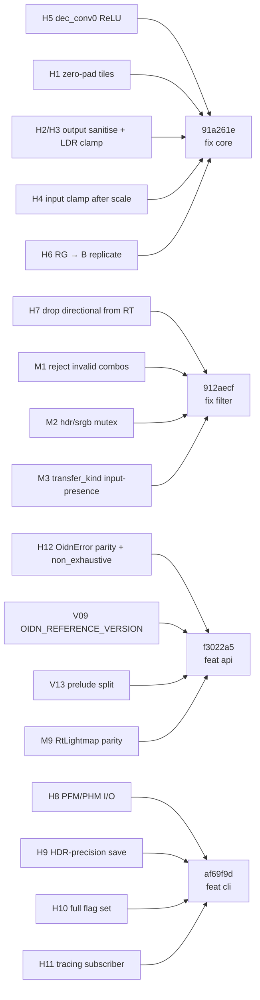
```mermaid
flowchart LR
    H5[H5 dec_conv0 ReLU] --> COMMIT1[91a261e<br/>fix core]
    H1[H1 zero-pad tiles] --> COMMIT1
    H2[H2/H3 output sanitise + LDR clamp] --> COMMIT1
    H4[H4 input clamp after scale] --> COMMIT1
    H6[H6 RG → B replicate] --> COMMIT1
    H7[H7 drop directional from RT] --> COMMIT2[912aecf<br/>fix filter]
    M1[M1 reject invalid combos] --> COMMIT2
    M2[M2 hdr/srgb mutex] --> COMMIT2
    M3[M3 transfer_kind input-presence] --> COMMIT2
    H12[H12 OidnError parity + non_exhaustive] --> COMMIT3[f3022a5<br/>feat api]
    V09[V09 OIDN_REFERENCE_VERSION] --> COMMIT3
    V13[V13 prelude split] --> COMMIT3
    M9[M9 RtLightmap parity] --> COMMIT3
    H8[H8 PFM/PHM I/O] --> COMMIT4[af69f9d<br/>feat cli]
    H9[H9 HDR-precision save] --> COMMIT4
    H10[H10 full flag set] --> COMMIT4
    H11[H11 tracing subscriber] --> COMMIT4
```

---

## Memory & ownership conventions

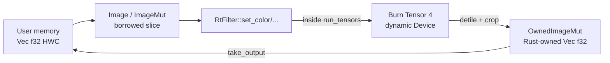
```mermaid
flowchart LR
    user[User memory<br/>Vec f32 HWC] --> image[Image / ImageMut<br/>borrowed slice]
    image --> rt[RtFilter::set_color/...]
    rt -- inside run_tensors --> burn[Burn Tensor 4<br/>dynamic Device]
    burn -- detile + crop --> accum[OwnedImageMut<br/>Rust-owned Vec f32]
    accum -- take_output --> user
```

Historical ownership diagram above describes the host adapter only. Tensor-native inputs and outputs use device tensors directly; exposure reads scalars, and optional diagnostics read full tensors (`unet_runner.rs:90-100,366-378`). External renderer integration was outside the initial static audit. The later user-authorized Squarebob follow-up checks its actual resource bridge; see [bridge audit](bughunt/squarebob_bridge.md). Comments naming a race do not prove present behavior.

Current reports: [pipeline](bughunt/pipeline.md), [model/weights](bughunt/model_weights.md), [geometry/API](bughunt/geometry_api.md), [CLI/verification](bughunt/cli_verification.md). No runtime image-parity result was produced.

---

## Local v2.5.0 sanitation contract follow-up

The primary reference order below is LOCAL2.5 (`D:/Projects/vfx.ref/oidn`); an optional stricter user sanitation policy is a separate decision. The current Rust ordering remains different.

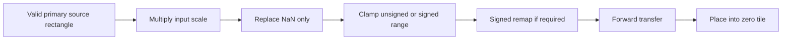
```mermaid
flowchart LR
    raw["Valid primary source rectangle"] --> scale["Multiply input scale"]
    scale --> nan["Replace NaN only"]
    nan --> clamp["Clamp unsigned or signed range"]
    clamp --> remap["Signed remap if required"]
    remap --> transfer["Forward transfer"]
    transfer --> pad["Place into zero tile"]
```

Evidence: LOCAL2.5 `devices/gpu/gpu_input_process.h:41-54`, `devices/cpu/cpu_input_process.isph:35-48`, `core/math.h:77-79`; Rust `gpu_ops.rs:29-32,51-55` sanitizes all nonfinite values before scale. Existing actual/proposed diagrams remain open audit artifacts; they do not assert backend numeric equality.

All P1–P11 were rechecked against local v2.5.0. Logical model topology/widths and TZA remain unchanged; native fusion wrappers changed without a discovered logical-order difference. Native weights submodule is uninitialized, so all 23 Rust binary headers/hashes establish only a local baseline. See [local pipeline](bughunt/local_pipeline.md), [local model/weights](bughunt/local_model_weights.md), and [plan2.md](plan2.md). No implementation or runtime verification occurred during that static local-reference pass.

## User-authorized renderer verification follow-up

The static pass above did not build or run tests. The later user instruction authorized Squarebob dependency updates and diagnostic testing; production fixes still await report approval. Current verification results are maintained in [Squarebob plan16](../squarebob-rs/docs/plans/plan16.md) and [plan2](plan2.md). The RTX 3080 Ti/Vulkan frozen-input probe passed: repeated adaptive output at 256 SPP and fixed-clamp output at 1/256 SPP were identical; adaptive output at 1/256 SPP changed by max absolute RGB 8.448264122. Another 32 fixed-clamp runs at 256 SPP were identical. This establishes stability for this frozen input/device/configuration and sample-dependent input influence, not the user's scene or general race absence.

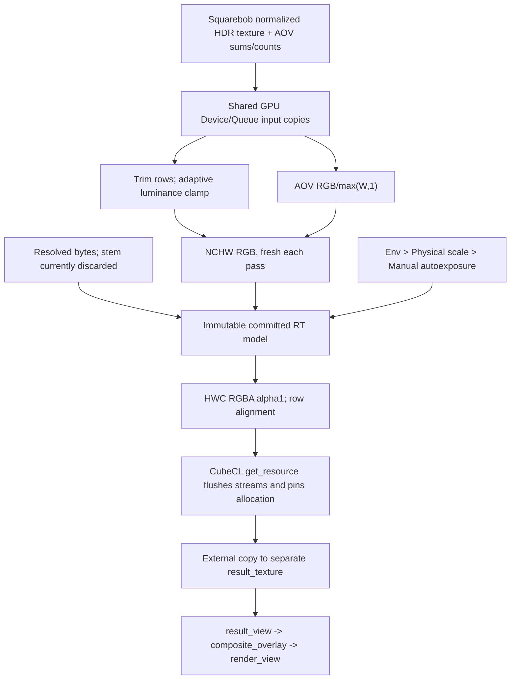
```mermaid
flowchart TD
    PT["Squarebob normalized HDR texture + AOV sums/counts"] --> Copy["Shared GPU Device/Queue input copies"]
    Copy --> Color["Trim rows; adaptive luminance clamp"]
    Copy --> AOV["AOV RGB/max(W,1)"]
    Color --> Input["NCHW RGB, fresh each pass"]
    AOV --> Input
    Weights["Resolved bytes; stem currently discarded"] --> Model["Immutable committed RT model"]
    Input --> Model
    Scale["Env > Physical scale > Manual autoexposure"] --> Model
    Model --> Output["HWC RGBA alpha1; row alignment"]
    Output --> Resource["CubeCL get_resource flushes streams and pins allocation"]
    Resource --> Result["External copy to separate result_texture"]
    Result --> Display["result_view -> composite_overlay -> render_view"]
```

Evidence: `../squarebob-rs/crates/pt-denoise-oidn/src/lib.rs:392-422,457-493,515-518,548-552,627,639-676,979-1012`; `../squarebob-rs/src/app/treemap_view.rs:1587-1606`; `../squarebob-rs/crates/render-3d/src/lib.rs:1217-1222`. No output-to-raw feedback appears in this inspected bridge. Detailed CubeCL pin/submission references are in the bridge report.

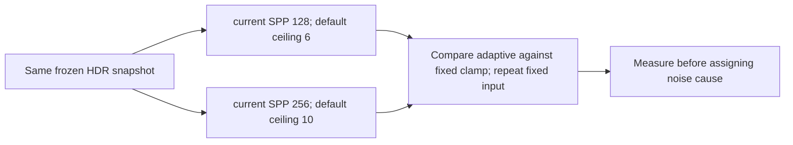
```mermaid
flowchart LR
    Frozen["Same frozen HDR snapshot"] --> Early["current SPP 128; default ceiling 6"]
    Frozen --> Later["current SPP 256; default ceiling 10"]
    Early --> Compare["Compare adaptive against fixed clamp; repeat fixed input"]
    Later --> Compare
    Compare --> Evidence["Measure before assigning noise cause"]
```

Default adaptive ceiling is constant after 256 SPP; this mechanism alone does not explain indefinite later growth. The final-scheduling defect can separately leave an older preview on screen: target 300/interval 128 displays256SPP after earlier successful periodic passes. See Squarebob plan16 for the proposed shared completed-SPP/accumulation state and remaining runtime gates.

Verification follow-up: the synthetic GPU probe and 32 fixed-input repeats passed, as did workspace compilation and actual squarebob binary linking. No actual-scene noise reproduction or native numerical parity result is asserted. Exact commands, logs, and device limits are in [Squarebob plan16](../squarebob-rs/docs/plans/plan16.md).

End of diagrams.

## Native measurements and shared PQ presentation follow-up

[Native runtime report](../oidn-rs/bughunt/native_runtime.md) records 90 successful finite synthetic runs and all 23 archive byte matches. Earlier missing-asset/no-runtime statements are historical. Aligned explicit-scale CPU/WGPU results are close; unaligned AOV and odd/tiny exposure are separate measured defects. The checker SD change measures restored contrast, not error against a clean target. See [Astra numerics](../oidn-rs/bughunt/astra_numerics.md).

The following display source is implemented under explicit PQ authorization; final actual-window/color/shader validation remains tracked in [Squarebob plan17](../squarebob-rs/docs/plans/plan17.md).

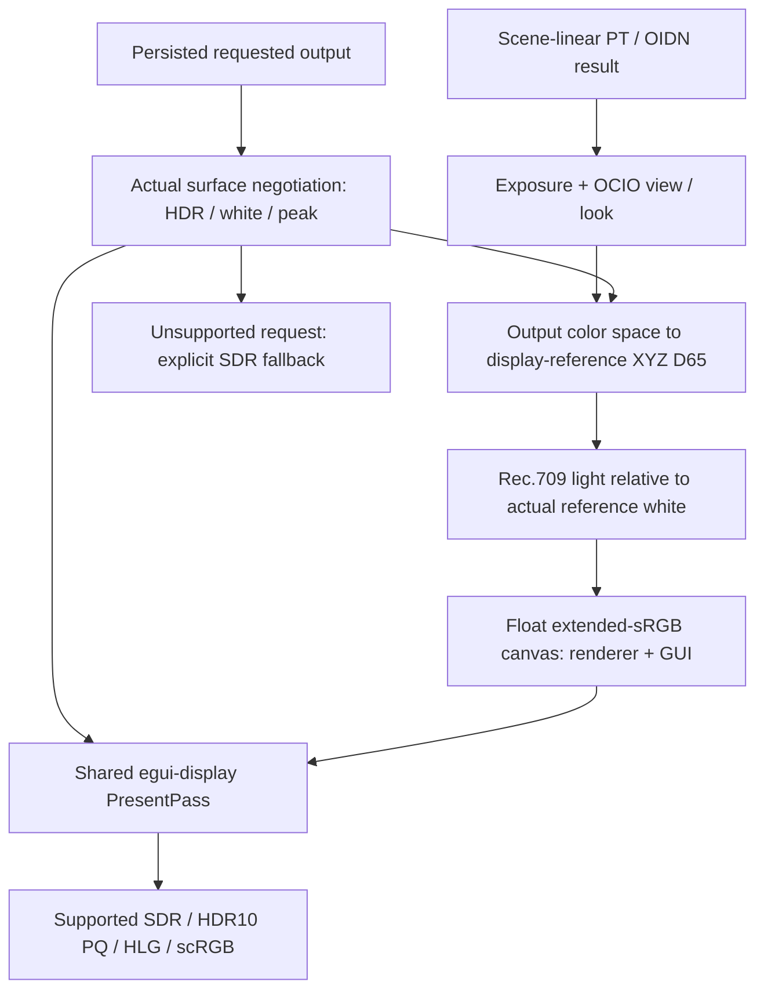
```mermaid
flowchart TB
    Raw["Scene-linear PT / OIDN result"] --> View["Exposure + OCIO view / look"]
    View --> Decode["Output color space to display-reference XYZ D65"]
    Decode --> Light["Rec.709 light relative to actual reference white"]
    Light --> Canvas["Float extended-sRGB canvas: renderer + GUI"]
    State["Actual surface negotiation: HDR / white / peak"] --> Decode
    State --> Present["Shared egui-display PresentPass"]
    Canvas --> Present
    Present --> Surface["Supported SDR / HDR10 PQ / HLG / scRGB"]
    Request["Persisted requested output"] --> State
    State --> Fallback["Unsupported request: explicit SDR fallback"]
```

PQ encoding belongs only to the shared presenter (`present.rs:127-149,202-215,766` at locked egui-widgets revision06acf665). Source anchors: Squarebob `display_host.rs:309-310,389-455,520-584`; color pipeline `lib.rs:772-808`. This diagram does not claim measured physical display luminance or reproduction of the user's scene. OIDN's PU transfer is unrelated to display PQ and remains a separate inference contract.

## CPU display source ownership after authorized repair

Earlier bridge diagrams covered GPU composition. CPU display now uses the same shared composition entry point for raw and denoised sources; it does not overwrite either raw source. See [Squarebob plan17](../squarebob-rs/docs/plans/plan17.md) and [Astra post-fix review](../oidn-rs/bughunt/astra_pq_review.md).

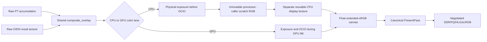
```mermaid
flowchart LR
    PT["Raw PT accumulation"] --> Shared["Shared composite_overlay"]
    OIDN["Raw OIDN result texture"] --> Shared
    Shared --> Lane{"CPU or GPU color lane"}
    Lane -->|CPU| Exposure["Physical exposure before OCIO"]
    Exposure --> Processor["Immutable processor; caller scratch RGB"]
    Processor --> Scratch["Separate reusable CPU display texture"]
    Lane -->|GPU| Blit["Exposure and OCIO during GPU blit"]
    Scratch --> Canvas["Float extended-sRGB canvas"]
    Blit --> Canvas
    Canvas --> Present["Canonical PresentPass"]
    Present --> Surface["Negotiated SDR/PQ/HLG/scRGB"]
```

CPU immutability/order and bounded full-PresentPass signal tests passed; actual GUI retry and main push remain pending. This does not resolve the user's scene noise cause or authorize unrelated denoiser repairs.

## Final verified persistence and output state

Actual PBR/PT GPU/PT CPU windows and CPU-state restart passed; actual output is HDR10(PQ), Rgb10a2Unorm/Bt2100Pq. This supersedes preceding pending-GUI notes. Main publication is explicitly authorized; receipt belongs in OIDN plan3. Multi-monitor/manual lifecycle and physical luminance remain unverified.

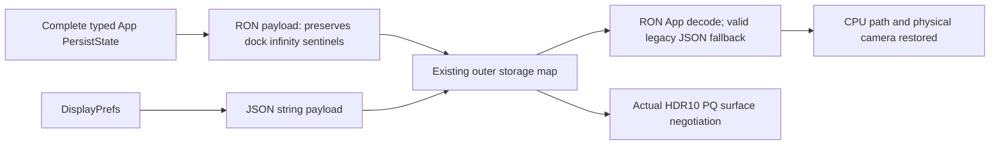
```mermaid
flowchart LR
    App["Complete typed App PersistState"] --> RON["RON payload: preserves dock infinity sentinels"]
    Display["DisplayPrefs"] --> JSON["JSON string payload"]
    RON --> Map["Existing outer storage map"]
    JSON --> Map
    Map --> Restore["RON App decode; valid legacy JSON fallback"]
    Restore --> CPU["CPU path and physical camera restored"]
    Map --> Negotiation["Actual HDR10 PQ surface negotiation"]
```

## Current systematic repair flow — verified scope

The user approved the outstanding OIDN repairs; [plan4.md](plan4.md) tracks every P/MW/G/C finding. Earlier implementation-pending approval statements are historical. This flow describes the implemented source: common construction at `filters/mod.rs:16`, descriptor at `oidn-model/src/descriptor.rs:30`, resolver at `weights.rs:142`, balanced exposure at `autoexposure.rs:137`, valid-source packing at `unet_runner.rs:207`, and ordered output at `gpu_ops.rs:68`. Final CPU/feature/GPU/lint gates passed in the bounded scope recorded below.

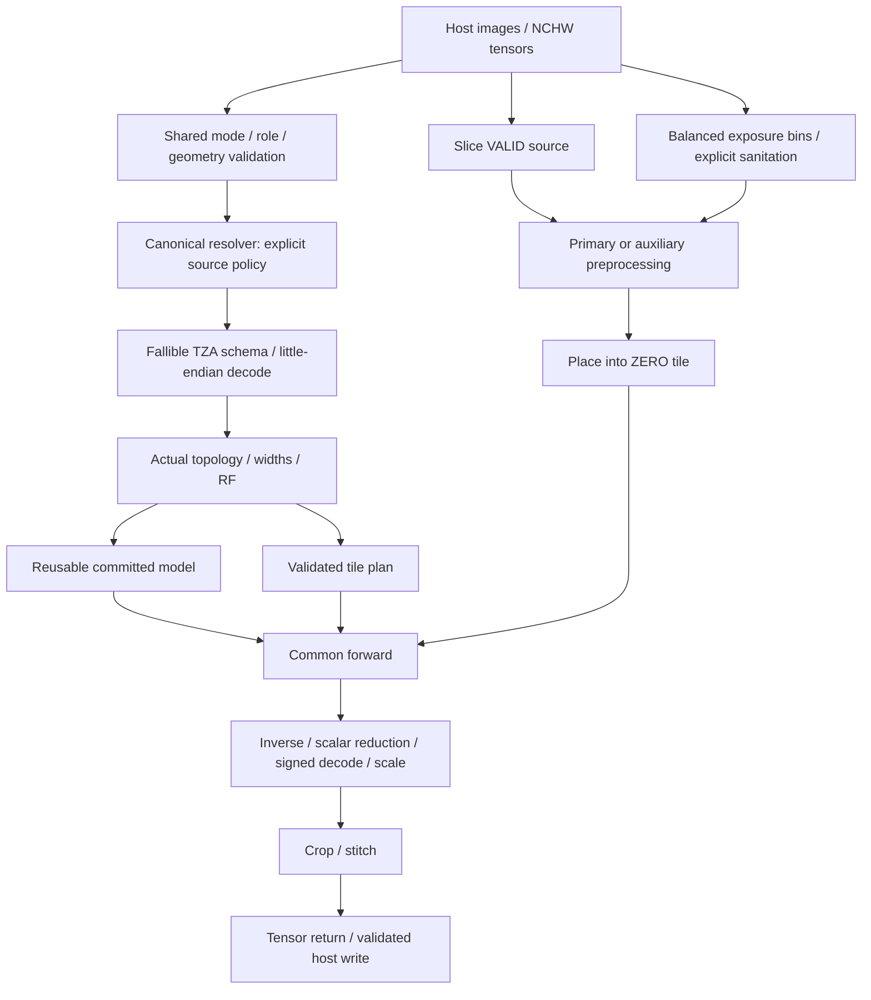
```mermaid
flowchart TB
    Input["Host images / NCHW tensors"] --> Validate["Shared mode / role / geometry validation"]
    Validate --> Resolve["Canonical resolver: explicit source policy"]
    Resolve --> Schema["Fallible TZA schema / little-endian decode"]
    Schema --> Descriptor["Actual topology / widths / RF"]
    Descriptor --> Artifacts["Reusable committed model"]
    Descriptor --> Tiles["Validated tile plan"]
    Input --> Exposure["Balanced exposure bins / explicit sanitation"]
    Input --> Source["Slice VALID source"]
    Source --> Prep["Primary or auxiliary preprocessing"]
    Exposure --> Prep
    Prep --> Zero["Place into ZERO tile"]
    Artifacts --> Forward["Common forward"]
    Tiles --> Forward
    Zero --> Forward
    Forward --> Post["Inverse / scalar reduction / signed decode / scale"]
    Post --> Stitch["Crop / stitch"]
    Stitch --> Result["Tensor return / validated host write"]
```

Post-fix matched-input validation completed 108/108 finite matrix runs and 6/6 Large runs. RustWGPU/nativeCPU matrix maximum is 0.0003814697. The Large High clean-aux 769x16 fixture uses RF202 and two tiles; tiled/full maximum is zero. This covers one wide/thin seam geometry. Final workspace/all-target tests with `embed-all,acescg-autoexposure` passed 96 tests, with 14 GPU tests intentionally ignored; the explicit required-GPU lane then passed all 14. Strict Clippy and strict rustdoc passed. Large full/tiled GPU comparison checks two/one actual callbacks and error <=1e-4 (`tests/multi_tile_wgpu.rs:194`). Exact commands and earlier focused receipts remain in [plan4](plan4.md). Exact commands/hashes/precision limits are in [postfix receipt](bughunt/native-verification/postfix/receipt.json). The progressive scene-noise cause remains unproven.

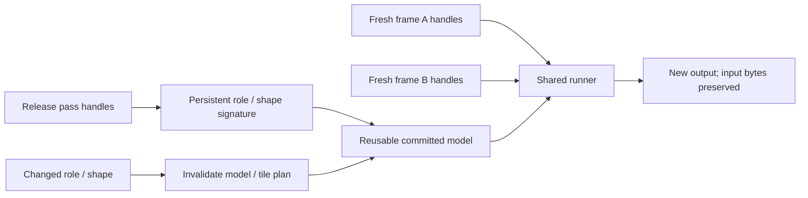
```mermaid
flowchart LR
    Signature["Persistent role / shape signature"] --> Cache["Reusable committed model"]
    A["Fresh frame A handles"] --> Run["Shared runner"]
    B["Fresh frame B handles"] --> Run
    Cache --> Run
    Run --> Output["New output; input bytes preserved"]
    Release["Release pass handles"] --> Signature
    Changed["Changed role / shape"] --> Invalidate["Invalidate model / tile plan"]
    Invalidate --> Cache
```

The cache state is separate from consumed frame tensors (`rt.rs:208,730`). The runner validates selected-device identity and exact `[1,3,H,W]` inputs before numerical operations (`unet_runner.rs:88`). Host ownership uses the shared validated `OwnedImage`; TZA aliases share one immutable archive backing allocation. Automatic exposure reads final scalar reductions; enabled tensor diagnostics can still read full tensors. Default strict nonfinite sanitation is optional, while native NaN-only sanitation after scale remains mandatory.

The current Squarebob consumer follows the same canonical commit and runtime-scale path. Its isolated local-Git-patch workspace check and fresh GPU probe passed, with 32 identical frozen-input repeats; the original renderer lock remains unchanged. Publication and the permanent renderer Git-revision update are pending report review.

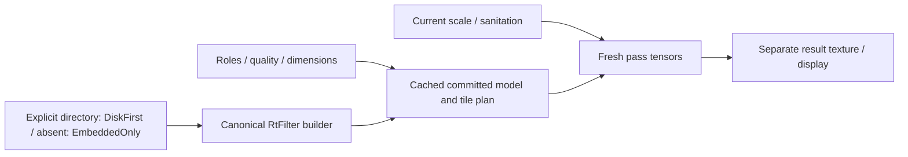
```mermaid
flowchart LR
    Policy["Explicit directory: DiskFirst / absent: EmbeddedOnly"] --> Builder["Canonical RtFilter builder"]
    Key["Roles / quality / dimensions"] --> Commit["Cached committed model and tile plan"]
    Builder --> Commit
    Runtime["Current scale / sanitation"] --> Execute["Fresh pass tensors"]
    Commit --> Execute
    Execute --> Result["Separate result texture / display"]
```

Current consumer anchors: `../squarebob-rs/crates/pt-denoise-oidn/src/lib.rs:516,528,533,559`. Frozen adaptive-clamp changes remain input-policy evidence; the user's actual progressive-noise cause remains unresolved.
